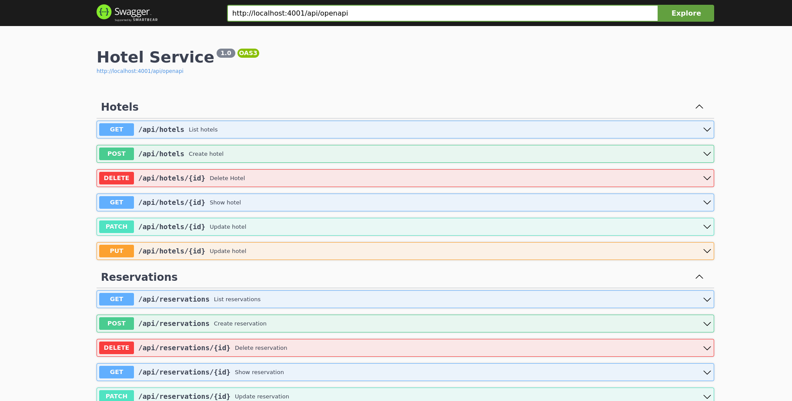

# Sagaz

Sagaz is a microservice travel booking application that demonstrates distributed
transactions using the Orchestrator [SAGA
pattern](https://learn.microsoft.com/en-us/azure/architecture/reference-architectures/saga/saga).

When a user tries to book a travel through the **Booking Service** it will
first book the flights using the **Flight Service** and then book their hotel,
via the **Hotel Service**. If the flights were already booked but the hotel
reservation fails for some reason, they will be unbooked by the SAGA
Orchestrator (Booking Service).

This project is made mainly to showcase and serve as base for the following:

- Distributed transactions using SAGA.
- OpenAPI and Swagger using [open_api_spex](https://github.com/open-api-spex/open_api_spex)
- Communication between microservices using custom HTTP Clients
- Idempotent seeds

# Table of Contents

- [Sagaz](#sagaz)
- [Architecture Diagram](#architecture-diagram)
- [Running it locally](#running-it-locally)
	+ [Starting the Services](#starting-the-services)
	+ [Interacting the Services](#interacting-with-the-services)
- [Deploying to Kubernetes](#deploying-to-kubernetes)
- [Developing](#developing)

# Architecture Diagram


# Running it locally

## Starting the Services

```sh
docker-compose up
```

## Interacting with the Services

You can then check the services and interact with their APIs either by accessing
their [Swagger](https://swagger.io/) page (**/api/swagger** endpoint) or using a
custom HTTP client, such as [Postman](https://www.postman.com/).

The following ports are exposed by docker-compose:
- `8080`: API Gateway
- `4000`: Booking Service
- `4001`: Hotel Service
- `4002`: Flight Service



# Deploying to Kubernetes

Inside the **k8s** directory, there are some kubernetes objects used to create
and configure a service's database, its deployment and create a kubernetes
service for it.

For Example:

```sh
# Creates and configure a postgres instance for one of the services using a
# local volume (useful for testing in minikube, for example)
kubectl apply -f k8s/booking-db-deployment.yml
```

Note that the provided kubernetes setup does not handle container image
uploading, it's up to the user to add the images.

# Developing

Currently the required development dependencies (Elixir, etc...) are installed
via [Nix](https://nixos.org/). In order to access the development environment,
run the following command:

```sh
nix develop
```

Now being inside the development environment, you can manually run and develop
your services independently.
