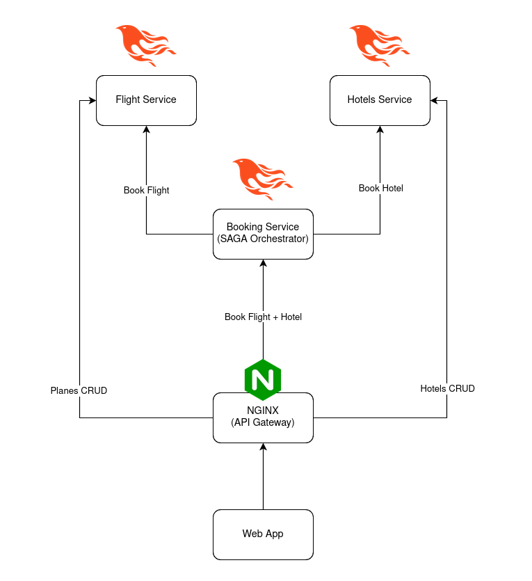

# Sagaz

Sagaz is a microservice travel booking application that demonstrates distributed
transactions using the Orchestrator SAGA pattern.

When a user tries to book a travel through the **Booking Service** it will
first book the flights using the **Flight Service** and then book their hotel,
via the **Hotel Service**. If the flights were already booked but the hotel
reservation fails for some reason, they will be unbooked by the SAGA
Orchestrator (Booking Service).

## Architecture Diagram



## Running it locally

```sh
docker-compose up
```

## Developing

Currently the required development dependencies (Elixir, etc...) are installed
via [Nix](https://nixos.org/). In order to access the development environment,
run the following command:

```sh
nix develop
```

Now being inside the development environment, you can manually run and develop
your services independently.

# TODO: 
- [ ] Add Swagger to APIs
